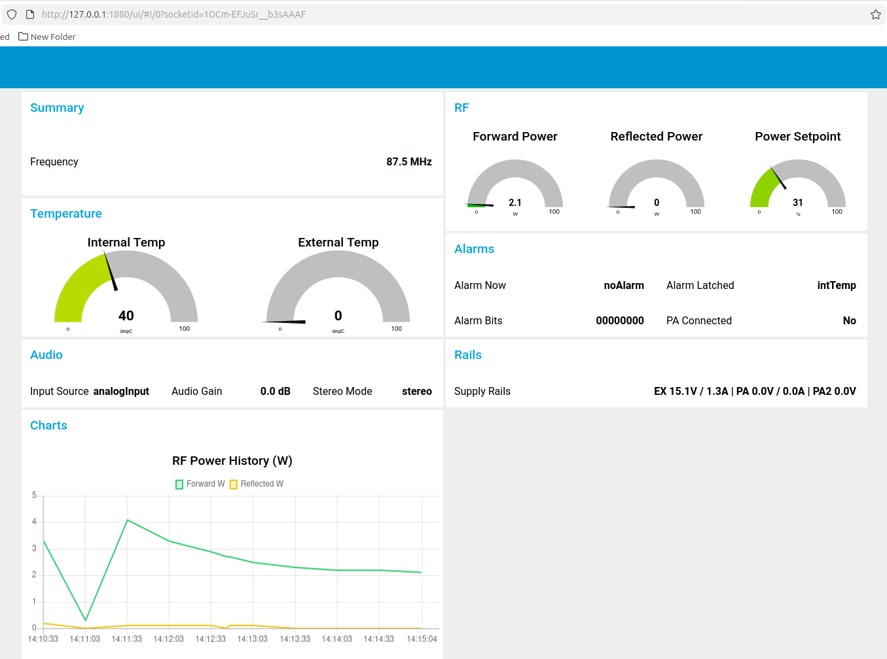

# PCS Node-RED SNMP Dashboard

This folder contains an importable Node-RED dashboard flow that polls PCS transmitter SNMP telemetry using the `PCS-ELECTRONICS-MIB`.

## Files

- `pcs-transmitter-snmp-dashboard-flow.json`: Full flow export with SNMP polling + dashboard gauges/text/charts.
- `pcs-electronics.mib`: Local MIB copy used by the flow.
- `poll_pcs_snmp.sh`: Script called by the Node-RED `exec` node.

## Prerequisites

Install these on the Node-RED host:

- Node.js + npm
- Node-RED (`node-red` command in `PATH`)
- Node-RED Dashboard plugin (`node-red-dashboard`)
- Net-SNMP CLI tools (`snmpget` in `PATH`)
- Network access to transmitter SNMP endpoint (UDP 161)

Example install commands:

```bash
npm install -g --unsafe-perm node-red
cd ~/.node-red
npm install node-red-dashboard
```

## Manual Import (Required)

1. Start Node-RED.
2. Open the editor (default: `http://127.0.0.1:1880`).
3. Menu -> **Import**.
4. Import file: `pcs-node-red/pcs-transmitter-snmp-dashboard-flow.json`.
5. Click **Deploy**.
6. Open dashboard UI: `http://127.0.0.1:1880/ui`.

## Configure

Open flow tab `PCS Transmitter SNMP` and adjust environment values:

- `PCS_TX_IP` (default: `192.168.1.140`)
- `PCS_SNMP_COMMUNITY` (default: `public`)
- `PCS_MIB_DIR` (default path points to this folder)

`PCS_MIB_DIR` must contain `pcs-electronics.mib`.

## Notes

- Polling interval is 30 seconds.
- SNMP polling is chunked to max 5 OIDs per `snmpget` request.
- If symbolic MIB lookup fails, script falls back to numeric OIDs.
- If SNMP returns errors, check `SNMP stderr` and `SNMP return code` debug nodes.
- The Node-RED dashboard, flows, and helper scripts in this folder are AI generated.


